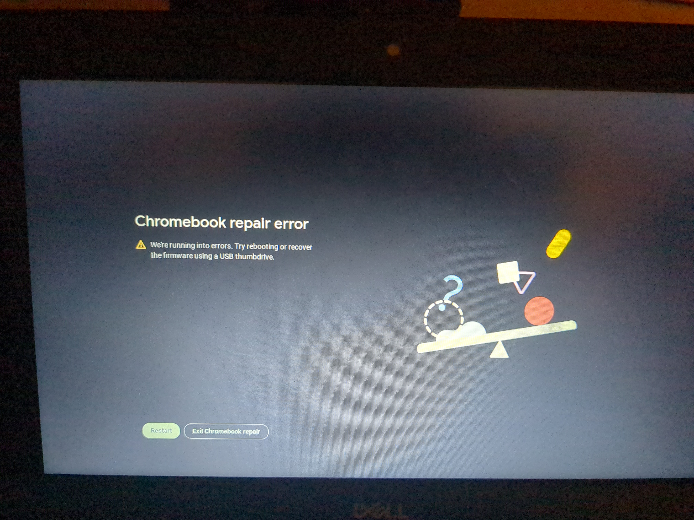
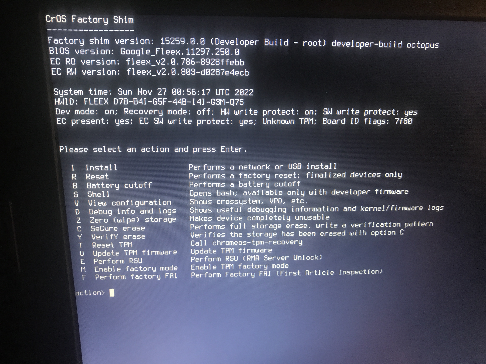
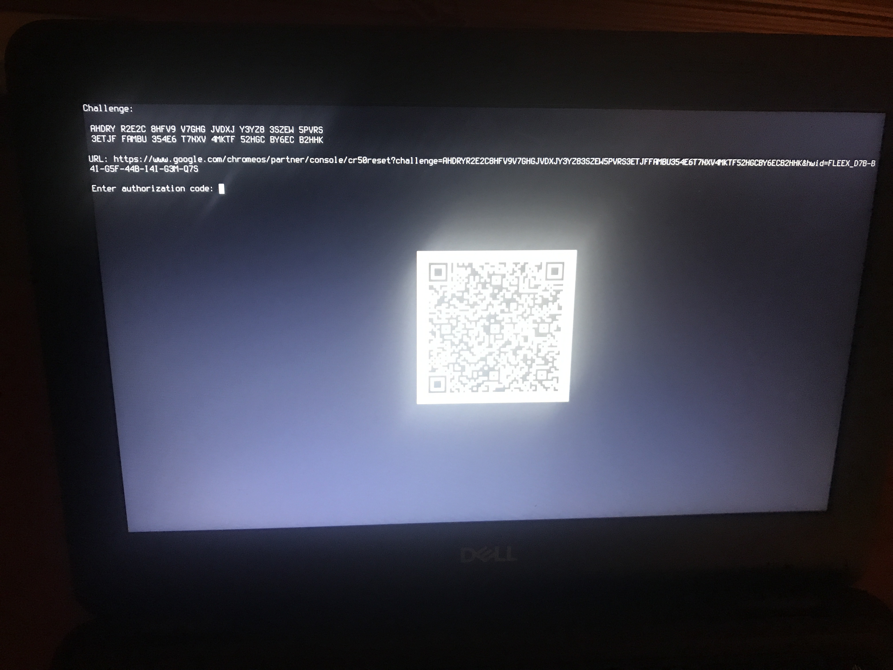
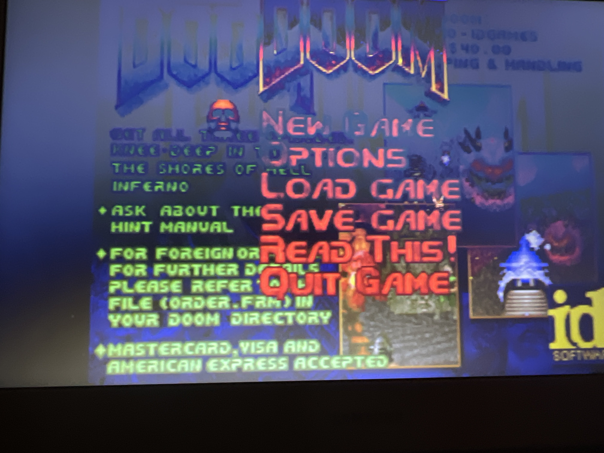

## More Context

Yes, this is about sh1mmer. It also talks about reco modding and a lot of other cool stuff relating to it.
First of all, read [part 1](/blog/breaking-cros-1) if you haven't already.

## Goal

In part 1, we were simply trying to find bypasses in enterprise enrollment, but there are several cases in which the conditions reqired for those methods cannot be met.
Our new goal is to get new ways of executing shell code, as root, preferrably without even needing to be signed in.

## The actual ChromeOS security model

In order to understand what we did with it, I need to explain what it actually is. Google implemented a very robust system for ensuring the integrity of the entire system.
Every bootable chrome os image contains 12 partitions, only 3 of which are relevant.
The first partition is the "stateful" partition, which contains purely user data and is heavily encrypted. Nothing on it will actually get executed, which is what we would need.
The next partition is KERN-A, containing the kernel and initramfs for ChromeOS, a stub that will initalize the rest of the operating system.
Finally, there's partition 3, "ROOT-A", more commonly referred to as the rootfs. This is where Chrome and all the other programs running on ChromeOS are stored.

To understand the purpose of all of these, let's run through a typicial boot.
Upon powering on the machine, the first code that runs is the board's firmware.
The firmware is static and cannot be reasonably modified by an attacker. The firmware reads the KERN-A partition and makes sure its signature is valid.
If the kernel has been tampered with in any way, the firmware will refuse to load it. Note that _only_ KERN-A is validated here. Next, the kernel and initramfs are loaded.
The initramfs contains some scripts that will get ran before anything on ROOT-A is loaded.
We can't we modify the contents of ROOT-A externally, because patched into the kernel is a system called [dm-verity](https://source.android.com/docs/security/features/verifiedboot/dm-verity).
If the hash of any files don't match, it refuses to read them or let them get executed.

## Recovery Image Modification

The proccess for ChromeOS recovery mode is actually very similar.
Instead of the recovery being handled by firmware, it boots a "recovery image" which handles the recovery proccess.
However, dm-verity is not enabled for ROOT-A. So can we modify a recovery image? Yes!
A small obstacle is that google sets a special readonly bit inside the ext2 root partition making you unable to mount it as writable through traditional means.
Digging through the os source source, we found we can use a modified version of chrome's vboot_util scripts to convert it back to standard readwritable ext2 and edit the chromeos-install script to contain arbitrary code.
Now we plug in a usb containing our modified image, and the code gets run. Is that it? Did we find a new vulnerability? Not yet.
The recovery image warns about it being being "unofficial", and trying it on an actual enrolled device will show this error.


So clearly being able to modify it on non managed devices is intentional for developers and debugging, but maybe we could disable the enrollment check?
Looking around in the files, it's clear that whatever file is responsible for this error message is not in the ROOT-A partition that we have control over,
but instead has to be in initramfs on the KERN-A partition, the one we can't actually modify due to the signatures being hardcoded in the firmware.

Let's pop open the initramfs. I'll be using `binwalk`'s extract feature on KERN-A.
At first the `init` shell script is ran, and eventually a script called something_something.sh in /lib/ gets ran.

Here's the part responsible for this error.

```
if [ "$USB_DEV" != "/dev/dm-0" ] || is_unofficial_root; then
    is_developer_mode_blocked && return $ERR_DEV_MODE_BLOCKED
    return 0
fi
```

If the verification fails, and the `block_devmode` value is present it will exit recovery before running the modified chromeos_install.
We could maybe reverse the steps that binwalk took and pack it back into the image on KERN-A,
but with google's magic signature broken, the firmware will refuse to boot the kernel, saying that the usb does not contain a valid recovery image.

## RMA Shims

An RMA (return merchandise authorization) shim is a factory tool designed to be used by mostly repair centers for resetting chromebooks,
changing their serial numbers, running tests, etc. In theory it would be able to wipe enrollment.
The shim itself is a .bin file similar to a recovery image which you then flash to a usb that can be plugged into chromebooks to boot it.
These shims are kept confidental by chromebook manufacturers and one that is officially signed (meaning it works on any chromebook without enabling unsigned boot) should never end up in the hands of an end user, so we struggled to obtain them.

### Shimless RMA

While researching the RMA shim flow, we came across this [reddit post of a student managing to activate a repair screen](https://reddit.com).
This wasn't an RMA shim, it didn't look anything like what we had known about it, but plugging the strings into chromium code search revealed it was part of a feature known as "Shimless RMA".
I could not find any information about it online or in the chromium wiki, but it appears to be unfinished.
We noticed the `--launch-rma` flag and could activate it with the same method as in [part 1](breaking-cros-1), but when we did it gave us this screen



After plugging the strings into chromium code search and looking around for a while I could conclude that yes,this was the same menu as what was reportedly seen in the reddit post,
but that the error that lead to that screen was K_RMA_NOT_NEEDED, essentially telling us that "RMA mode" had not been enabled.
Curiously enough there also exists a SWA in chrome os with the url `chrome://shimless-rma`, but it's also nonfunctional. We decided to stop looking into this as it didn't seem like it would be possible given how little information we had.

### RMA Leak

Suddenly, out of nowhere, Unciaur found a site called lenovo-driver-download.com, which hosted several shim files while he was looking for wifi drivers, and showed it to us.
The downloads are hosted on the official download.lenovo.com domain unprotected, but the site itself appears to be unofficial, owned by an unrelated third party.
What's important was that now we had our hands on some RMA shims, and were able to start looking at them.

The anatomy of the shim is almost identical to a recovery image. Flashing it as one and plugging it in during recovery while devmode is enabled allows it to boot.

The menu options include (stuff, more stuff, even more stuff).
Pressing bash shell doesn't work since this isn't a dev image, but in theory the cr50-reset option could wipe enrollment.
Let's try on an enrolled chromebook.

Ah. Apparently when block_devmode is set (which is default for enrolled chromebooks), it skips straight to the factory install option,
which needs you to put in a code that only people with authorization would have access to.

## SH1MMER

Searching for the text on that screen shows us the code responsible for this behaviour.

```bash
if crossystem 'block_devmode?1' 'wpsw_boot?1' 2>/dev/null; then
    echo
    echo "crossystem flag 'block_devmode' is set on a write protected device."
    echo
    echo "You need to disable hardware write protection to bypass this check."
    echo

    # Run cr50-reset.sh if available
    if command -v /usr/share/cros/cr50-reset.sh >/dev/null; then
      echo "Defaulting to RMA reset"
      sleep 2
      # Perform an RMA reset
      action_e
    fi
    return 1
fi
```

This code exists on the ROOT-A partition, the one **we control**. Using the same proccess from Recovery Image modification,
we can simply take out this entire check and replace it with whatever code we want. But won't we run into the same dm-verity issue as the recovery images? Nope.
Unpacking the initramfs for the shim kernels instead shows this

```
cgpt find -t rootfs "$(strip_partition "$USB_DEV")" || return 1
REAL_USB_DEV="$USB_DEV"
LOG_DEV="${USB_DEV%[0-9]*}"1  # Default to stateful.

mount_usb
```

This code will simply mount the usb and trust whatever the contents are, instead of how they were mapped to a verification block in the recovery images. Now we can get the device to run any code.

Naturally, the `vpd -i RW_VPD -s check_enrollment=0` command still works, and due to a quirk of how cryptohome isn't mounted from shims,
we get a bonus feature: being able to turn off the "devmode blocked" screen without unenrolling fully.

```
crossystem block_devmode=0
vpd -i RW_VPD -s block_devmode=0
cryptohome --action=take_tpm_ownership
cryptohome --action=remove_firmware_management_parameters
```

What we have now is a USB stick that can be inserted into the chromebook on the recovery screen, and it will unenroll without any user interaction.
Due to it's reliance on RMA shims, we dubbed the exploit "shimmer". I immediately rushed out to buy the shimmer.me domain, but it was already taken so we instead went with sh1mmer. 1337speak is not dead yet!

The only issue was that the lenovo-driver-download.com leak only contained a limited amount of shims. Since the image is different for each "board", sometimes different models of chromebooks needed different shim images, and again, these shim images are supposed to be kept exclusive to companies and repair centers. This is when OlyB made a breakthrough and was able to source a shim for almost every board. I have been asked not to disclose the method of obtaining, but we managed to dowload all of them and upload them to an archive server.

The shim images are quite interesting. At least for the octopus shim, looking in /etc/lsb-release reveals that it was based on chromeOS version 73.
It has most of the utilites of a standard chrome install, but many things, notably the `/opt/google/chrome/chrome` binary is misssing since it isn't needed on a shim, so we can't just boot into chromeOS. Still, we knew we could push the shim much further.

Trying to play audio through `aplay` throws an error, so as much as I would have liked to make a rickroll shim it unfortunately isn't possible. Next we tried getting a wifi connection; it would be useful for testing and autoupdates. Because of the fact that the shim is running chrome 73, the wifi driver is outdated for most people. Running `dmesg | grep iwlwifi` will reveal the name of the firmware that's loaded, which we can then download the latest version of and set it to be placed in `/lib/firmware`. Now, running `ip link` will show the wifi card as a device.
But we couldn't actually connect to anything yet, as the standard wifi utilites that linux would have is, you guessed it, replaced by custom google stuff.

### Chromebrew Mounting

Here's where more of r58's shim magic comes into place. If you're unfamiliar with chromebrew, it's essentially just an unofficial package manager for chromeOS.
It lets you install a ton of useful software binaries and libraries not typically in chromeOS.

First you would install chromebrew on a normal devbook and shove its files into a compressed archive, take the shim image and create a brand new 13th partition,
filling it in with the contents of chromebrew.
Upon boot of the RMA shim, the 13th partition can be mounted over /usr/local,
giving the shell scripts accesss to whatever software we install.

Crucially, we can get python to install. Due to chrome's automated unittests typically written in python, those scripts can hook into the system and perform special actions.
When we clone the `autotest` folder in the chromiumOS source tree back into /usr/local we can run the scripts.
And fortunately for us, one of those scripts was designed for testing chrome's "shill" networking daemon. Running the script allows us to connect with shill to any networks not protected by enterprise authentication.

### Beautiful World

As you probably noticed, the release of shimmer has a full GUI. But how is that possible? Aren't we booting to a tty?

Because google just so happens to be google, they couldn't just let themselves use linux's default framebuffer based VT.
Instead, they made their own VT replacement called "frecon". For some reason, it has full color support and if you give it certain escape sequences it will print images directly to the screen.
A friend of one of the team members (who has chosen to remain anonymous) made us all the assets we would need, and the rest of the GUI was written by me and r58 in bash.

After chromebrew and GUI support, there was nothing stopping us from adding all the optional payloads we wanted. A script that bricks chrome? Sure! The firmware utility script that allows you to boot linux or even windows from your chromebook? Why not! The critically acclaimed indie platformer celeste, running inside the weston desktop environment?


But can it...



Yes! Yes it can!

If you want to use the exploit, you'll have to [build it yourself](https://github.com/CoolElectronics/sh1mmer)

## Mitigations & The Patch

<sub>(hi sysadmins again)</sub>

Unlike our [previous report](https://coolelectronics.me/blog/breaking-cros-1), this chain is completely unmitigatable by a sysadmin who would want to stop users from running this on their own devices.

Google on the other hand could fix it. There's a single key inside the firmware that validates all the signatures for the shim images.
They would first have to fix the critical bug inside the initramfs that allows us to inject code in the first place, but then they would have push out a firmware update that deployed a new set of keys.

Once the firmware update hits, every single shim usb in the world would suddenly stop working, requiring the repair centers to get them from the manufacturers, and the manufacturers to get a bunch of from google. Overall, a large logistical issue.

Somehow, we managed to find enough additional bugs to fit in a [Part 3](/blog/breaking-cros-3) and maybe even a [Part 4](/blog/breaking-cros-4). Again, expect a delay before it goes public.

## Credits

Finding original RMA shim - Unciaur<br/>
Recovery image modification - r58playz & ULTRA BLUE (Bideos)<br/>
Finding shim vulnerability - CoolElectronics<br/>
Finding additional RMA shims - OlyB<br/>
Chromebrew Mounting - r58playz<br/>
Beautiful World - ULTRA BLUE<br/>
Doom - justinchrm<br/>
The Mercury Workshop team
