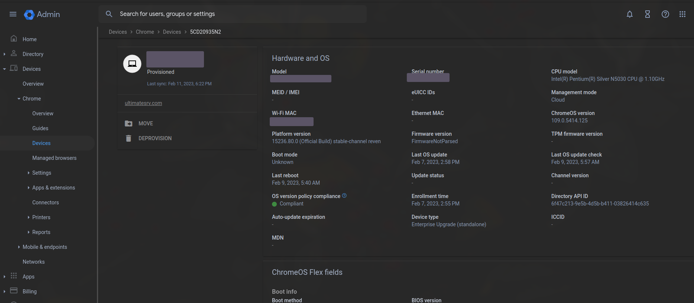
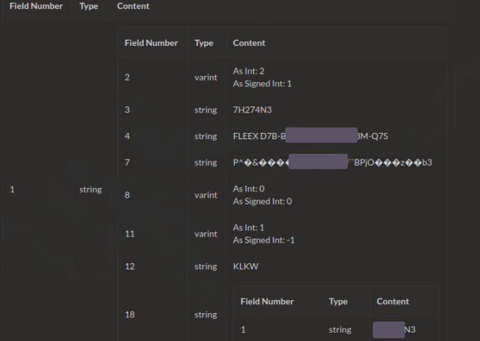
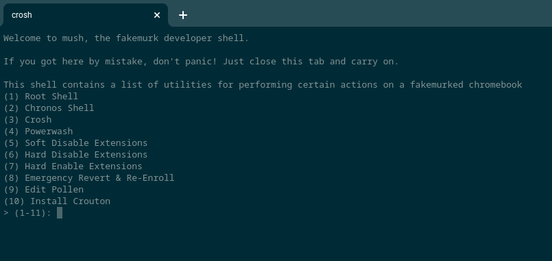
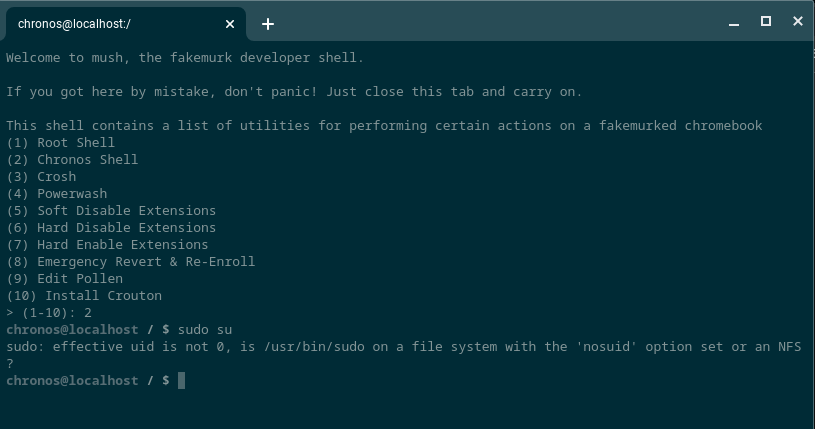
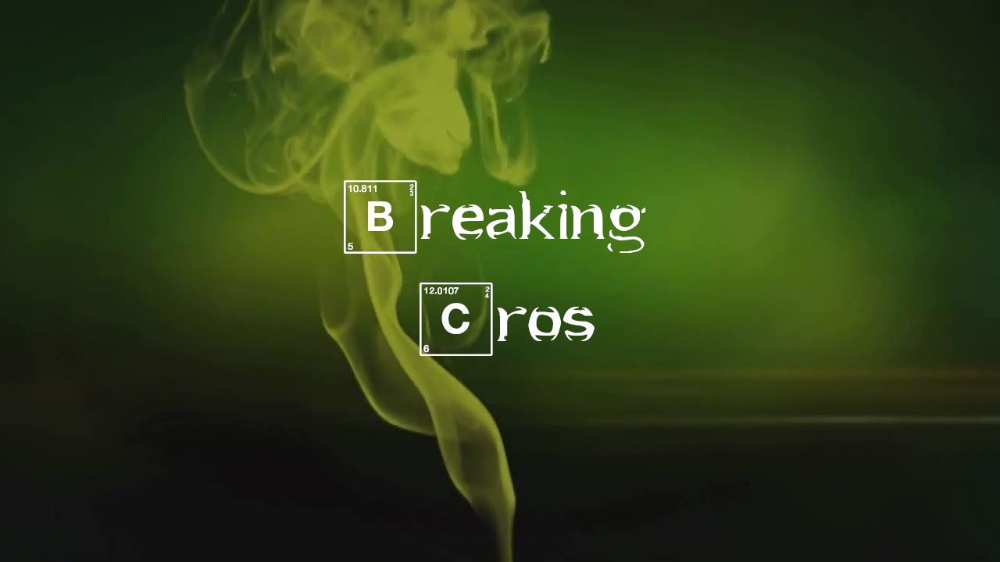

## Even more context

Again, you're going to want to read [Part 1](/blog/breaking-cros-1) and [Part 2](/blog/breaking-cros-2) if you haven't already.

First things first, the patch for sh1mmer has been confirmed to be rolling out in stable release 111 and LTS 108/102, but at the time of writing the patch has not hit stable. More info about the patch and its ramifications will be found in [Part 4](/blog/breaking-cros-4) when it comes out.

Until then, the naive among you may be thinking something along the lines of "What's there left to do? (almost) Universal unenrollment is already easily possible with sh1mmer, leaving you with nothing to try and bypass!"

And while to a certain extent that might be true, unenrollment or not, there's still so much left to be found and created.

For this series of findings, we focus on things you can do after unenrollment is accomplished to deal with some of the consequences of having your chromebook unenrolled.

There's a good chance you came here from the [fakemurk repository](https://github.com/MercuryWorkshop/fakemurk), and if so you already know what this writeup is for and what I'm going to be talking about. Feel free to skip ahead.

And for everyone else:

Hello, welcome. Why don’t you take a seat? Get comfortable, relax, take a second if you need to. Now what’s fakemurk? Well, why don’t we start at the beginning?

## The obvious, glaring issue with unenrollment

In all previous writeups here, I've tried to sidestep around it, but quite obviously the sh1mmer and unroll exploits, as well as pretty much everything the Mercury Workshop group's done or will ever do are designed for use on school chromebooks because unsurprisingly, at the time of writing all of our members are either in middle or high school.

Clearly the IT people, sysadmins and teachers down at your school district aren't going to like kids deprovisioning their chromebooks, but until the mentioned patch comes out there's not a great deal they can do, but enough to be somewhat of a threat.

The biggest issue is Google Admin Console. It reports many kinds of values about provisioned chromebooks.
Here's an example of what a provisioned chromebook might look like.

Immediately, what jumps out here is the "last sync date" which will slip further and further into the past. If the "Heartbeat" policy is enabled, you would see similar things. 
A common method to stay somewhat hidden is to re-enroll every week or two, but that's generally pretty annoying.

Another possible method is to use [MrChromebox's RW_LEGACY rom](https://mrchromebox.tech/#fwscript) to boot linux from a USB while staying enrolled. Unfortunately, you need to be in [devmode](https://www.chromium.org/chromium-os/chromiumos-design-docs/developer-mode/#attacker-with-casual-physical-access) to use this, which if you stay enrolled will show up in the admin console, which will stick out like a sore thumb to any competent sysadmin. Rounding up everything, the ultimate goal here is be to fake, spoof, or intercept the policy sync and values that will eventually get sent to the Google Admin Console

### Api Spoofing

The first thing we tried was to get the raw http requests for enrollment, log and eventually replay them with custom values. While _ChromiumOS_ is open source, _ChromeOS_ isn't. This means that if you do look into the [source code of ChromiumOS](https://source.chromium.org), some things are going to just be missing, and the device management API appeared to be one of them. Instead, we tried capturing the packets in transit. `tshark` can be easily installed through the chromebrew tool, and by using the arbitrary launch option script from [Part 1](/blog/breaking-cros-1) the `SSLKEYLOGFILE` environment variable can be used to decrypt https encryption. 
Running through enrollment with tshark active yielded this for one of the API endpoints: `https://m.google.com/devicemanagement/data/api?retry=false&agent=Google+Chrome`
The request came with a bunch of encoded "protobuf" data, and throwing it into [https://protobuf-decoder.netlify.app/](https://protobuf-decoder.netlify.app/) gave this
 (serial number and hwid censored)
We chased down a few more requests, but they all followed the same format: an odd api endpoint on `m.google.com`, some limited use api tokens with no explanation of where they came from, and a mix of protobuf and garbage data. While it might have been possible to trace all these requests down, or use what we have in the chromiumOS source code to build a custom devicemanagement client, we decided to give up on this vector and move on to our next option.

### Schrödinger's Enrollment / Brunch

The [Brunch Framework](https://github.com/sebanc/brunch) is a project allowing you to boot ChromeOS on certain x86 computers. It will take a stock recovery image and modify it with special patches. 
By default, enterprise enrollment is completely unsupported on brunch. When it tries phoning home to google servers, it has to provide a serial number, which with brunch simply does not exist. The OS gets the serial number from the Vital Product Data or VPD, which I talked more about in [Part 1](/blog/breaking-cros-1). If we could inject our own faked serial number into there, you could theoretically get a random computer or VM with brunch installed to pretend it was your managed chromebook and enroll into management. 
However, that's a bit more easily said than done. 95% of the the high-level logic running on your chromebook(box?) is handled by a single binary executable located at `/opt/google/chrome/chrome`, compiled from closed-source C++. None of the logic in that binary can be changed in any way through reasonable means. But what about the other 5%? Since ChromeOS is really just a frankensteined version of Gentoo linux (except injected with google spyware), there's a good amount of low-level logic implemented in bash. Bash is an interpreted language, so what you see (and can edit!) in the file is exactly what happens when you run it. 
Obviously, you can't just import C/C++ code into bash and have it run, so there are many other pieces of logic contained in separate compiled binaries that are called from bash. And while we still can't reasonable modify these files, we can replace them entirely with our own code, and ChromeOS will trust its values for everything it does. 
r58playz, who you might know for having magical chrome powers created [vpd.sh](https://github.com/MercuryWorkshop/fakemurk/blob/main/vpd.sh), a reimplementation of the VPD binary in bash that reports fake values for all values, serial number included.

With this, and a few slight patches to upstart services we were able to get brunch to succesfully run through the enrollment proccess. At first you would think that's perfect, exactly what we wanted to accomplish.
Except brunch is... weird. The project is attempting to run proprietary software designed for use on very specific hardware on a stock standard pc, and that becomes painfully obvious when we rebooted the machine afterwards and it bricked itself. The issue stems from the fact that a lot of features in ChromeOS, such as user data and enrollment depend on google's special proprietary TPM module called the "Titan C". Since this chip won't exist on a standard PC, brunch deletes the `cryptohome` utility that connects to it, breaking a proccess known as "attestation" in the proccess, which is what's required for enrollment to work fully. Short of somehow emulating chromebook hardware, we decided this would be impossible.

(If you're wondering why we didn't use flex, it has its own weird code setting it apart from stock chromeOS that makes it so it would be infeasible to make it pretend it was a normal chromebook)

## fakemurk

Except, wait a second. If we could impersonate the system utility that reports the serial number on brunch, why couldn't we impersonate the utility that lets ChromeOS know whether a real chromebook is in devmode or not in the first place? Then, we could turn OS verification off, use a custom root filesystem, and even boot linux via RW_LEGACY without the risk of the devmode status tripping alarms in the admin console.

r58playz came back to create the sequel to vpd.sh, [crosssytem.sh](https://github.com/MercuryWorkshop/fakemurk/blob/main/crossystem.sh). Replacing /usr/bin/crossystem with our custom script, we can spoof these three values: `cros_debug`, `devsw_boot`, `devsw_cur` to all equal zero, making the OS (and admin console!!) completely oblivious to our poking around. 
The first issue we ran into was that the OS tries to transition from developer mode back to verified mode since it thinks we're in verified. It then fails for obvious reasons and gets stuck in a bootloop of constantly trying to go back to verified.

The solution to this ended up being to completely incinerate the "stateful partition" with `mkfs.ext4`, and let chrome rebuild it upon booting up, clearing away all traces of devmode and stopping the condition that leads to this bootloop. While this does work, it's difficult to run without sh1mmer, as you can't `mkfs` a mounted partition and you can't unmount a partition in use. I managed to get around this by fumbling around with upstart to inject the format call before the rest of the system boots. If you were wondering why the system restarts immediately after booting the first time you install fakemurk, that's what it's doing.

The setup for crossystem.sh was quite tedious, with values needing to be manually pasted in, so a setup tool would be needed. 
Taking inspiration from Rory's privesc.tars, I went with the method of abusing makefiles and the C preproccessor in order to pack up crossystem.sh and all the neccesary dependencies into one giant fakemurk.sh bash script. 
Since all dependencies are compressed and baked into the script, it could be ran offline as a sh1mmer payload. 

Now, the OS thinking we're not in developer mode also means we don't get any of the cool developer features that ChromeOS would otherwise offer, so we have to hack them in ourselves with increasingly more scuffed patches.

### mush

If you're reading this, you're already familiar with the built in `crosh` "shell" 
The funny part is it's really just a javascript implementation of a terminal emulator which runs the /usr/bin/crosh executable... which is just a normal binary, nothing special about it at all. In fact, we can even just straight up delete it and replace it with our own bash script, letting us patch whatever custom features we want into a menu accessible from the browser. 

Crosh always runs as the non-root user for obvious security reasons, so let's elevate to root and..

Oh. Since the OS thinks we're in verified (non-developer) mode, it refuses to let filesystems be mounted with the "setuid" bit, breaking sudo in the proccess. We even tried setting up our own suid mount with a generic [setuid backdoor](https://github.com/MercuryWorkshop/fakemurk/blob/main/backdoor.c) to no avail. We tried a few other methods of escalation, but eventually settled with the tried and true, yet boring localhost ssh. 
The setup for it is fairly simple, just get the `sshd` command pointing to a custom config file to be run as root (we hook chromeos-startup.sh for this) and plop an rsa key somewhere that chronos can read. Now `ssh -t -p 1337 root@127.0.0.1` can be used to run any command as root. Terribly insecure, but that's kinda the whole point.

The problem with being enrolled is that both user and device policies still apply, an one of those policies could be to add the URL for crosh to the URLBlocklist, or to disable it entirely in SystemFeaturesDisableList, locking you out of being able to visit this menu. SInce frecon doesn't run in verified, you can't switch to VT2 either.

### Pollen

There's a relatively undocumented feature in chromium, where a JSON file can be placed at `/etc/opt/chrome/policies/managed/policy.json`, and any [User Policy](https://chromeenterprise.google/policies/) can be set, overriding cloud policy. With this you can completely get rid of URLBlocklist an SystemFeaturesDisableList, allowing you to visit crosh regardless. Additionally, you can start messing around with some of the other policies, such as corrupting ArcPolicy, VmsAllowed, and DnsOverHttpsMode with an invalid value to let you use crostini, the play store, and dns over http even if it would typically blocked. For pretty much any restriction placed, there's a value in policy.json that can override it, with the exception of _device policies_, which cannot be set through this method.

All of these modifications came with a tradeoff, though. In order to patch the filesystem like this we had to set a flag in the kernel that disables rootfs verification. Because of google's [devmode security model](https://www.chromium.org/chromium-os/chromiumos-design-docs/developer-mode/#attacker-with-casual-physical-access), developer mode needs to be perpetually enabled for the system to boot at all, or else you will be met with a "ChromeOS is missing or damaged" screen.
Autoupdates also need to be disabled, as they completely replace the rootfs so it would need to be repatched very single time otherwise. And if you're reading this, you probably don't want to recieve the firmware patch that will permanently fix the vulnurability sh1mmer relies on, so pinning to R110 is the best idea.

Another small annoyance is that during a policy sync, the DeviceBlockDevmode policy will be applied, locking you out of developer mode and being able to boot the OS. Since there's also some weird tpm locking stuff going on, the normal method of disabling it that we used in sh1mmer didn't work, and I wasn't able to trace down how exactly the tpm gets unlocked. Fortunately, it takes a little while for the tpm to re-lock after getting unlocked during a sync, and by constantly spamming `cryptohome --action=remove_firmware_management_parameters` during that time window, we can win the stupidest race condition known to man. The upstart pre-startup hook is used here to get very early code execution, running the ["fakemurk daemon"](https://github.com/MercuryWorkshop/fakemurk/blob/main/fakemurk-daemon.sh) as a payload. Note that since we really have no way of knowing when a policy sync is going to happen, the "racer" is perpetually running during the OOBE setup screen.

### emergency revert

Another issue arose from the requirement of having devmode be enabled 100% of the time, that being the turnaround time if you decided you didn't want your chromebook to be "fakemurked" anymore. You would need to do a full "recovery" of the chromebook to flush out all the bits that get modified, a proccess that can take upwards of 10 minutes, and it requires an external USB stick!! If you're paranoid about your school's local IT person popping in for the mandatory monthly chromebook inspection, this isn't acceptable. 
If you could somehow overwrite the rootfs and kernel partitions in the drive with backed up, unmodified partitions then the reverting proccess would be almost seamless and much easier than a full recovery.

Except, these backups are going to be very large, and chromebooks are famous for having... not very much space on the internal storage. 
But what if ChromeOS already had a system that keeps track of multiple kernel and root partitions? 
You might not have thought about this much before, but ChromeOS has completely seamless automatic software updates, at least compared to windows which can reboot several times during the proccess. This doesn't sound like _too_ grand of a feat, after all most linux distributions such as gentoo, which chromeos is (loosely) based on will do this automatically, just by overwriting the files that should be updated and letting them get run as they normally would. Except once you remember the fact that a large part of the security model is based around the concept that everything but user data should be immutable and impossible to change, updates start looking a lot more challenging. The developers addressed this by implementing an "A" system and a "B" system, where first the A kernel is loaded and verifies the A rootfs, and come update time it can start downloading the updates to the "B" system. Then, the B system is set to be booted next, and the cycle repeats.

The separate space already allocated for A and B means we could hijack them for storing our backups. 
So instead of disabling rootfs verification globally, the fakemurk setup will shift around the mounts so that the system currently loaded will be used as the backup and left unmodified, while the alternate system becomes the target for patching. 
This also lets us get away with not needing a reboot in the middle of the script to disable rootfs verification. `cgpt`, google's partitioning tool is used to force the patched system to boot next. The existing autoupdate system has to be forcefully ripped out by nuking `chromeos-setgoodkernel`, `chromeos-firmwareupdate` and either deleting `update_engine`/`update_engine_client` (thanks `PiKATchu#3939`) or changing the value of `AUSERVER` in `/etc/lsb-release` to a bogus url (thanks phene?) 
When the revert option is hit in mush, `cgpt` can be used again to force the backup system to boot, resuming the update cycle and bringing the chromebook back to normal in less than 30 seconds.

### enrollment credential capturer

There's a certain policy that disables default user reenrollment. This means if anything ever happens to your (chromebook, recovery, powerwash, etc) and that policy is set, you won't be able to fix it yourself and will have to ask IT nicely to enroll it for you with their specially configured enrollment account before the chromebook is usable. There would be no reason for them be suspicious of the chromebook, but with control over the startup scripts and root we can listen to `/dev/input4`, and analyze it with [logkeys](https://code.google.com/p/logkeys/) (which funnily enough is hosted on a \*.google.com domain) to capture the account credentials.

As a disclaimer, this section is for us doing research and documenting findings, has never been used in practice, and none of the code for this section appears in the release build of fakemurk.sh. I don't want any of you clowns going "OMG FAKEMURK SHIPS WITH A KEYLOGGER!!!!" anywhere. If you want to play around with this feature, you can compile logkeys and the script yourself.

## Credits

mush, fakemurk.sh - CoolElectronics 
Schrödinger's Enrollment, crossystem.sh - r58playz 
Pollen - Rafflesia 

 
 
 
 
Logo - kaitlin 
