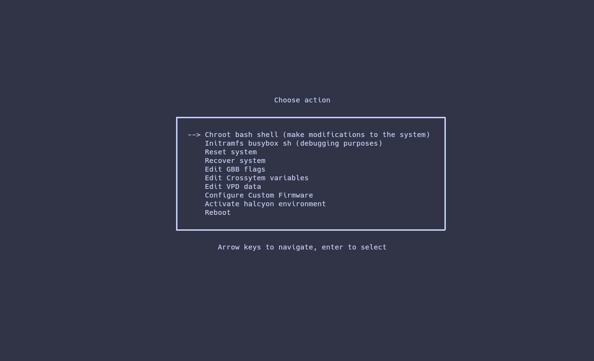
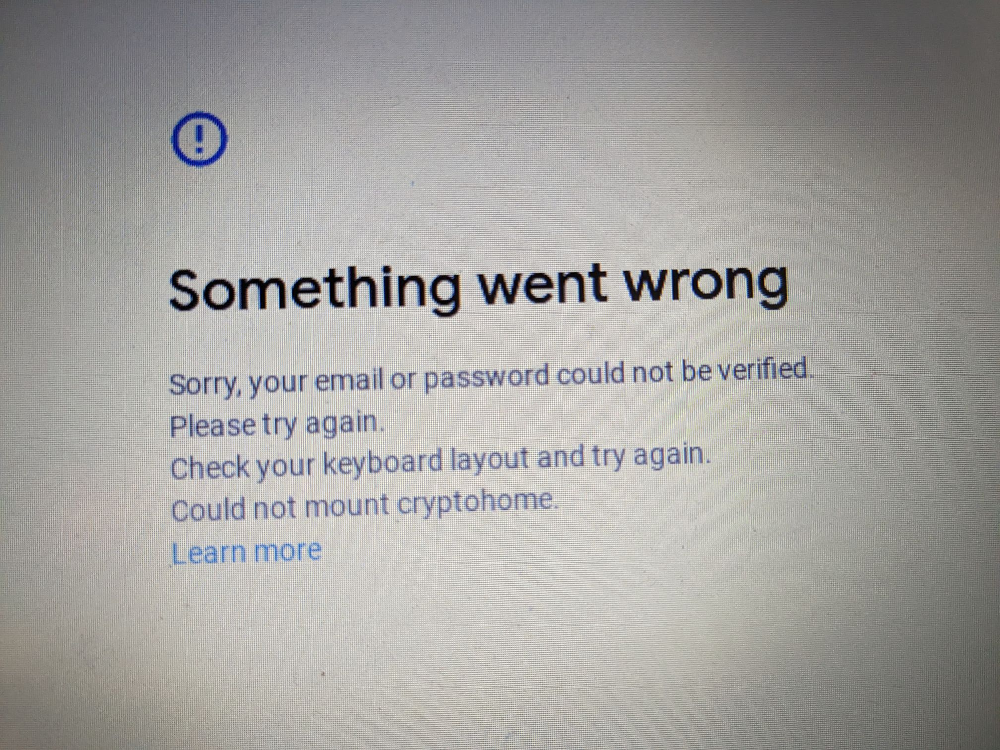

As always, make sure to read [the full series](/blog/breaking-cros-1) to understand everything going on here.

Well, here we are, at part **FIVE** of a series that was really only supposed to have 2 parts.. ever.<br/>
Very likely this will be the last post here in this series, so thanks to all who have been following this far.

# The Fog...

We all knew that an attempt to patch sh1mmer was going to come eventually.
In part 2, I predicted that they would "roll" the keys of the image signature, rendering them unbootable, which I assumed was really the only thing they could do against something like this.
But.. then chromeOS release 111 rolled out, and [this](https://source.chromium.org/chromium/chromium/src/+/main:chrome/browser/ash/policy/enrollment/auto_enrollment_type_checker.cc;l=382) bit of code was added.

```
  // The FWMP flag DEVELOPER_DISABLE_BOOT indicates that FRE was configured
  // in the previous OOBE. We need to force FRE checks to prevent enrollment
  // escapes, see b/268267865.
  if (dev_disable_boot) {
    return FRERequirement::kExplicitlyRequired;
  }
```

But what does it actually do?
If you remember, the "enrollment escapes" I described in part 1 and 2 relied on switching the value `check_enrollment` from 1 to 0 in the VPD firmware block.
What this line will do is ignore the value of check*enrollment entirely and ALWAYS attempt to phone home to google to enroll, \*\*\_IF*\*\* the dev_disable_boot/block_devmode flag is set in the FWMP (FirmWare Management Parameters).

But that doesn't make sense?! Don't we control the presence of that flag through `cryptohome --action=remove_firmware_management_parameters`?

Well, we did, before R111. What I _presumed_ google did (can be confirmed [here](https://chromium.googlesource.com/chromiumos/platform/ec/+/563de01ea8af922d1c4a527f7074f03b46812e2a%5E%21/#F0)) was forbid the modification of certain data regions in the TPM/cr50 where the FWMP is stored, but only when the system was booted in recovery mode.
Since that's a firmware level patch in the TPM itself it can't be downgraded, but the actual code that tells it to ignore check*enrollment is in software so you can simply downgrade to a version below R111 to unenroll.
As for block_devmode, the unenrollment process will eventually call `remove_firmware_management_parameters`, and since that runs when the system \*\*\_isn't*\*\* in recovery mode it goes through just fine.
So R111 doesn't patch sh1mmer nor root escalation unenrollment, it simply adds an extra step.

Now, what's extra funny is that they messed up the TPM update that would add the FWMP restrictions so badly that it [**started bricking random chromebooks**](https://www.reddit.com/r/k12sysadmin/comments/11r68sz/chromebooks_shutting_off_and_going_to_recovery/), even ones that weren't even enterprise managed and had never seen sh1mmer, and yes I have proof that this was directly caused by them trying to patch sh1mmer.

We assumed this was just a temporary mitigation to quell the horde of reports to google about kids unenrolling, and that a real key roll firmware patch would come shortly.
If you remember in part 4, the odd behaviour that allowed us to unenroll was caused by the mismatch with the firmware updating, so it's likely that if they had done a full firmware patch in that manner (note that TPM firmware updates are different from board firmware updates) that it would have been able to trigger the bug and a new method of unenrolling would have been possible.

But instead ChromeOS R112 rolled out, and alongside it came another TPM firmware update that **blocks downgrading**.<br/>
Not by making recovery media unbootable, but instead during the boot process if the TPM detects a kernel signed with an older version of the mp-keys it will just say "no" and boot you straight to the recovery screen.
Combined with the blocking of FWMP modification during recovery mode and the double check before allowing the user to get past OOBE, this solves unenrollment neatly without the need for a full key roll.<br/>
Or at least, that's what they _thought_...

Note that all the patches described in R112 and R111 also apply to the LTS versions of chromeos 108 and 107 respectively.
If you've never updated to 112 before, great! hop on fakemurk, disable updates, and keep it that way. And if you have a board old enough not to have a cr50, then you can still unenroll through a variety of methods.

## Post fog unenrollment

GBB flags are special firmware values that you can set to change the behaviour of the chromebook, as long as [Hardware Write Protection is disabled](https://wiki.mrchromebox.tech/Firmware_Write_Protect#Hardware_Write_Protection).
If you don't know what you're doing and modify them, it's easy to accidentally soft-brick, which is why sh1mmer has the handy option to clear them.

This wasn't clear, and yes it is our fault for a lack of explanation but a lot of people try to use the option when they don't need to, but to clarify **GBB flags are cleared by default on your chromebook**, so no need to use the utility unless you messed up badly.

Tangent aside, one of the GBB flags is `GBB_FLAG_DISABLE_FWMP`, which will allow devmode to be enabled, even with block_devmode set.
So you can simply disable write protection, set the flag `/usr/share/vboot/bin/set_gbb_flags.sh 0x8000` and go into devmode, where since the boot type isn't recovery but instead just booting normally, you can switch to the VT2 console and run the cryptohome command to properly remove the FWMP and unenroll.

This isn't really a perfect solution however, as you still have to take apart the chromebook to disable write protection in most cases.

# RecoMod

As it turns out, due to all the features packed into sh1mmer including the bash shell, it ended up being pretty useful as a debugging/repair tool outside of just unenrollment. I ended up using it quite a lot for messing around with various things and fixing bricks unrelated to its initial purpose of deprovisioning chromebooks. Funnily enough I even heard that certain repair centers and even school sysadmins were using it due to the stock RMA shims being inadqeuate and hard to come by legitimately. So with a keyroll from google on the horizon that would disable the booting of said modified shims, it seemed like a good idea to recreate the feeling of an interactive repair/debugging enviroment in a way that was not reliant on an oversight from google.

All the way back in part 2 of the series, I talked about how it was possible to modify the scripts on recovery images, but they would only boot when `block_devmode` was set to zero in the VPD.
I am obviously not the first person to have found that, MrChromebox used to serve "fixflags" recovery images that would reset GBB flags instead of installing chromeOS, but there was little documentation, no user interaction, and no way of building it yourself.
I figured I could improve on this concept quite a bit and add extra features, as well as a nice automated script for building such images yourself.

Now, we are working fully within the bounds of what google intended in terms of code getting executed, they did add a special case for devmode just so people would be able to use custom images, but that doesn't mean there won't still be goofy workarounds and fun to be had.
Unlike RMA shims, the recovery image environment is somewhat sandboxed. While the shim's kernel/initramfs (remember, the part that we can't change as it's signed) will immediately boot the init on the usb yielding control completely, the recovery image's kernel/initramfs will keep control the entire way through, acting as both the init system and the UI (which is written as a shell script because google). In fact, it only loads one file from the usb's root (which is the only part we do control) that being `/usr/sbin/chromeos-install` (another shell script because google), and it's only loaded inside a chroot environment, restricting what files it can access and what it can do.

Since the socket for outputting text to the screen and recieving input isn't accessible inside the chroot, creating a GUI would be difficult/impossible under normal means (i guess you could technically get rid of frecon and render directly to the DRI? either way what i'm about to do is cooler)

## Chroot escape

While the chroot does impose restrictions, it's not safely sandboxed as no "jailing program" was used, and we have root privileges inside the chroot. (to be clear the chroot isn't intended to make it more secure, it just made google's job easier at the time, and my job harder now).
There happens to be a bindmount of the virtual /proc filesystem inside the chroot directory, giving us RW access to it from inside our chroot.
This lets us enter the true `/` root through the `/proc/1/cwd` symlink, but why stop there when we can do much better?

The existence of this bindmount also allows us to change the **runtime kernel parameters** through /proc/sys.
From the chromeos-install script inside the chroot we run `echo 0 > /proc/sys/kernel/yama/ptrace_scope`, and here's where things start to get interesting...

If you've ever used `strace` or `gdb` you should be familiar with the ptrace family of syscalls. They let you debug certain processes and get information about them at a low level.
But `ptrace` is much more powerful than just a debugger, and with the kernel parameter set above and the right knowledge of systems programming, it can be used to seize control of arbitrary processes

### Init hijacking

Enter [clamide](https://github.com/CoolElectronics/clamide). A tool I wrote months ago for a completely unrelated purpose, this will let us interface with ptrace from bash.
Calling it from our custom chromeos-install script, let's walk through what exactly happens.

- Now that ptrace_scope allows it we attach ourselves to PID 1, the entry point on the initramfs, the bash script that's currently serving as the UI, and the parent of the script we're executing in right now.
- The PTRACE_POKETEXT syscall is called, allowing us to modify the live memory of the init process as it's running
- The bytes `0x0f 0x05`, the instruction to trigger a linux syscall are written into PID1's memory directly at its current instruction pointer
- The int value that corresponds to the `EXECVE` syscall, as well as the path to another arbitrary script are loaded into the cpu registers (which I will refer to as `bootstrap-shell` from now on)
- The cpu steps forward a tick, and the instruction gets executed as PID1, completely replacing the init with our controlled script

With the owned script executing inside of what used to be PID1, we now are our own parent and have escaped the chroot entirely.
We kill the now orphaned siblings from `chromeos-install` and exit, handing off control to `bootstrap-shell`, the process that runs outside the chroot.

Now it's just a matter of making a cool menu and adding some utilities:


If you want to use RecoMod or contribute, everything is available at the [github repository](https://github.com/MercuryWorkshop/RecoMod)

# E-HALCYON

On a whim, I randomly decided to enter the interactive shell inside the frankensteined recovery image and try out the switch*root command.
In this scenario the switch_root command will unmount the current initramfs, move a specified folder to `/`, and transfer control of the current process to a specified program. An important thing to know here is that the root partition of the recovery usb is what gets installed onto the chromebook, and therefore it's a complete copy of ChromeOS.
An important distinction is that the init system of the initramfs is inside the \_kernel* of the recovery usb, which is on a separate partition from the _root_, so /sbin/init in this case means the init system of chromeos, not the init system of the recovery image (otherwise we would get stuck in an infinite loop)
The command I decided to run was `exec switch_root /usb /sbin/init`, which moves the system into the root of the recovery image and runs it's init, which is also the entry point for ChromeOS after the kernel loads it.

And shockingly it actually sort of worked? The ChromeOS logo popped up for a second before it ended up crashing, meaning it was trying to boot into the os, even though we started from a recovery image.
Mounting the "stateful partition" containing the mutable data, there was a file called "mount_encrypted_failed" at the root, indicating that it failed to properly setup encryption for the stateful partition.
I could have tried to fix it, but it was easier to simply disable the encryption alltogether. Fortunately, I'm not the only person to have struggled with this before, and the [Brunch Framework](https://github.com/sebanc/brunch) already has a [patch](https://github.com/sebanc/brunch/blob/r107/brunch-patches/40-custom_encryption.sh) that will mount the stateful partition in plaintext.

With the custom encryption and a few patches to `/sbin/chromeos_startup.sh`, I was able to get it fully booted with the UI showing up.
Except when I went to connect to wifi, no networks show up. Because of google's _amazing_ idea to require a google account to even sign in (and the fact that you can't even get into guest mode until it phones home to google servers) this is basically useless.

With a quick check to `dmesg` and `lsmod` we can see that there are no kernel modules loaded, at all. Kernel modules are responsible for interfacing with certain bits of hardware, so this also breaks audio, but at least it means we don't have to listen to the chromevox voice?

At first it seemed like an easy fix, just `modprobe iwlwifi`, but then I got hit with `Loading iwlwifi failed: Operation not permitted`

Checking the initramfs, we can see that just before `chromeos-install` is ran and we get code execution, the runtime kernel parameter `modules_disabled` is set to 1.
And no, we can't just set it back. The parameter is one-way, and once it's set it can't be undone, Instead we would need to find a way of getting code execution earlier.

## E EXPLOIT!!!!

Remember when I said that the initramfs only loads one script from the usb root? That technically wasn't true. It loads 3 different ones for different purposes. At first the tpm updater script seemed promising as an entry point, as you could pretend the battery was low and it would load a script that would run before modules were disabled, but tpm updates are disallowed when it detects it's loading an unverified image.

Instead, I found that under certain conditions it would load yet another bash script from /usr/sbin/wipe_disk.

```
if is_dev_channel; then
  # Listen for EVWAITKEY_KEY
  evwaitkey --include_usb --keys "${EVWAITKEY_KEY}" > "${EVWAITKEY_FILE}" &
fi
```

```
check_disk_wipe_requested() {

  local evwaitkey_output=$(cat "${EVWAITKEY_FILE}")
  if [ "${evwaitkey_output}" = "${EVWAITKEY_KEY}" ]; then
    # If EVWAITKEY is pressed, perform full disk wipe.
    dlog "Key is pressed, disks will be physically wiped."
    message disk_wipe_start
    chroot "${USB_MNT}" /usr/sbin/wipe_disk
    DISK_WIPE_RESULT=$?
    clear_eventlog
    message disk_wipe_end
  fi
  rm "${EVWAITKEY_FILE}"
}
```

The code doesn't execute by default, so there's still more to be done.
First of all is that is_dev_channel check. It should only go through if the recovery image was compiled from the developer channel at google. Except the place it checks for that value is in the root partition, so we can just... `sed -i s/stable/dev/ /etc/lsb-release`

Now, there's the whole "EVWAITKEY" thing. At first I assumed "key" in this context meant signing key or something, but apparently it meant physical keyboard keys. I didn't know what key it wanted me to press, so I just pressed all of them. After a few minutes of trial and error, it ended up being the "E" key, as in "Erase" I guess.
Hence, "E Exploit" (it's really not an exploit, but the alliteration is funny)

So by spamming "E" as the recovery image loads, we can get early code execution in `/usr/sbin/wipe_disk` and bootstap ourselves as the init system before the loading of modules gets disabled.
We switch_root into ChromeOS as before, and this time with the ability to insert modules the audio and wifi drivers will load properly (never been so glad to hear the chromevox voice before).

After signing into google and adding an account, we're greeted with this

"Cryptohome" is the service that manages and encrypts accounts and user data.
Since encryption and TPM tended to go hand and hand, I had a feeling it had something to do with the recent TPM firmware update mentioned all the way at the top that would block the reading and writing of certain TPM regions during recovery mode.
Looking into the logs of `cryptohomed` confirmed my suspicions, as it was complaining about not being able to get the "Install Attributes" region in the TPM and refusing to go any further.

## `cryptohomed` hell


Looking at cryptohome code, there seemed to be an insecure fallback mode that would use randomly generated values instead of using the TPM, but it was disabled for the compilation of the binary in the stable channel.

However, unlike in fakemurk where a lot of the logic was contained inside the `/opt/google/chrome/chrome` binary and therefore unchangable (as it contained proprietary code), `cryptohomed` is a standalone binary that should be fully opensource as part of ChromiumOS.
Theoretically, I would be able to compile a version of it myself in place of cros's stock version, with support for the insecure fallback. I grabbed a copy of ChromiumOS source and got ready to start compiling the build enviroment.

After a full 6 hours, everything had finished building and I was ready to start tinkering.
It took much more than just setting the flag but after a myriad of tiny patches OOBE went through fully and I was able to log in.
Of course, nothing could be that simple and user data was not persistent across reboots.

Getting full persistence without the TPM would require much more modification to the code, and due to the sheer size of it I decided to give up. (who'd want to use stock chromeos more than once anyway amirite)

Instead, I just configured upstart to run `tpm_manager_client take_ownership` to reset the tpm and void the install attributes so it wouldn't complain about them, nuke `~/.shadow` on reboot so it wouldn't get corrupted, and get on with my life, escaping cryptohomed hell, albeit unfufilled.

Since this entirely bypasses the normal boot process, it gets around the downgrade patch and allows us to modify the rootfs arbitrarily, booting into an unenrolled environment even after the inability to modify block_devmode in 111. The caveat of course is the fact that you need the usb to boot initially, but either way it's a neat way of extending the use of sh1mmer past R112, without needing to take off hardware write protection since taking apart your chromebook can be annoying.
Now that it was somewhat functional, I decided to dub it "E-HALCYON", a combination of the "e exploit" and the fact that it lets you load a "fake" unenrolled enviroment

More information and full instructions available at the [website](https://fog.gay). Really there doesn't need to be a website for such a simple thing but someone ended up buying the domain anyway so why not?

# Credits:

- GBB devmode unblock - OlyB/BinBashBananna
