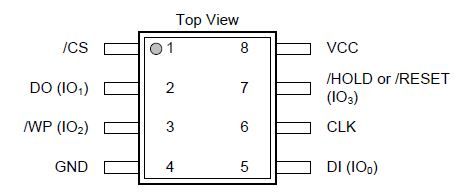
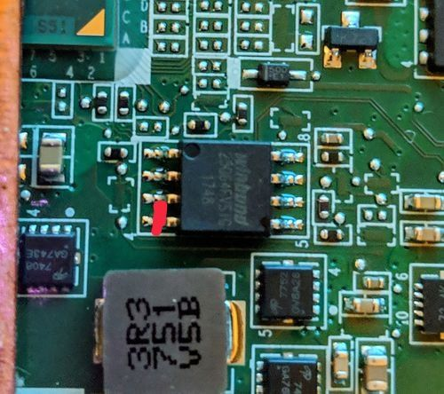

Hello! This is the true finale to the enrollment bypassing saga, make sure to read the other parts.

## The tsunami (fog 2.0)

As per the normal mercury rituals, OlyB was scanning chromium code search one night and found [this commit](https://chromium.googlesource.com/chromiumos/platform/ec/+/53a6bef971baa7110b6c2367554acf8b77331fb6%5E%21/#F1),
which immediately set off alarms. If you remember from part 5, we were able to circumvent the forced blocking of devmode by disabling the hardware write protection and setting GBB flags.
This commit, once released in an update would stop you from disabling hardware write protect entirely when the chromebook was enrolled. This breaks normal RMA shims too funnily enough
[which they later realized](https://chromium.googlesource.com/chromiumos/platform/ec/+/46fd92b93d48ce3c162ae2dd66a698faf3e6ad02) and also unfortunately makes repairing enrolled chromebooks much more difficult/impossible if you have to legitmately do repairs and don't have access to the official manufacturer factory toolkit, which is very difficult to get into.

Since we saw the commit as it was added, it hadn't been released yet and we had some time to prepare, you could still set the gbb flags from last part before you updated and you would permanently be able to unenroll whenever you wanted to, and
note that e-halcyon has nothing to do with write-protection and still works, without any need to take apart your chromebook.

To summarize, once updated to R114 and enrolled:

- sh1mmer itself can still boot
- sh1mmer will attempt to set the values of block_devmode and check_enrollment to zero in the VPD region of writable firmware, and succeed
- sh1mmer will attempt to remove the block_devmode flag in the Firmware Management Parameters, but fail because of the [patch introduced in R111](https://chromium.googlesource.com/chromiumos/platform/ec/+/563de01ea8af922d1c4a527f7074f03b46812e2a%5E%21/#F0)
- once rebooted into chrome os and seeing that the check_enrollment flag is set to zero, it will check the firmware management parameters, see that sh1mmer failed to remove block_devmode due to the R111 cr50 patch, and enroll anyway
- attempts to downgrade to an older version of chromeos using a recovery image will fail with the error "you are using an out of date recovery image". This can be bypasssed trivially, letting it install the older version to the internal storage
- trying to actually boot after installing the older version will fail because of the cr50 patch introduced in R112
- attempting to disable hardware write-protection and forcing devmode to be available will fail because of the cr50 patch introduced in R114

## So, what even is write protection?

Let's start with the basics. On every computer, chromebooks being no exception, the boot process starts with the motherboard firmware. On ChromeOS, this is where booting recovery images and from the internal storage starts from, it's the root of the trust model. So if it was able to be arbitrarily written to by anything, that would be pretty bad, wouldn't it??
As such, _writing_ to the firmware is _protected_ under certain conditions. That's what write-protection means, at the lowest level. However this is google we're talking about, so things get a lot more complicated, and write-protection ends up meaning a couple different things.

On modern chromebooks, the write-protected portion of the firmware is unlocked by the cr50, either when the battery is unplugged (which requires disassembling the chromebook), or using the RMA open method (which requires codes that you need certification from a manufacturer to obtain).
As of the recent patch, the cr50 will refuse to unlock the write protection on the firmware when enrolled.

But what if we were able to bypass the cr50, and unlock the write protection anyway? Let's get even lower level.

## the pencil bypass

If you open up the back of the chromebook, you can actually see the individual chips for the cr50 and firmware rom. 
While the cr50 is weird proprietary google stuff, the firmware is handled by an off-the-shelf SOIC-8 chip. You can even [flash it externally with a ch341a](https://wiki.mrchromebox.tech/Unbricking), more or less the same way you would flash an arduino. But that's not what we're interested in here.

Anyway, here's the schematic for the rom chip used in most chromebooks. The pin that has the text "WP" is what controls whether write-protection is enabled on the chip itself.
If you look very closely at the board, you might even be able to see the trace running from the cr50 to the write-protection pin. When the pin is connected to a power line, write protection is on. When the pin is connected to ground, write protection is off.

Can you see where I'm going with this?

Fortunately for us, the WP pin and ground pins are directly next to eachother. If you were to short them together with... oh, let's say a pencil...

Then there would be absolutely nothing stopping you from doing whatever you want to the firmware.

The GBB flags are stored in a partition of firmware typically protected from writing. So from the sh1mmer bash shell, making sure the pins are properly shorted with the connecting instrument of your choice, run `/usr/share/vboot/bin/set_gbb_flags.sh 0x8000` and the command will succeed, writing directly to the SOIC-8 chip and allowing you to boot into devmode, where you can fully remove enrollment. As it's a hardware level bypass, this is virtually unpatchable (outside of rotating the rma shim keys). 
Even though you can write directly to the firmware, the cr50 still thinks write-protection is enabled, so any scripts that check if you have write-protection enabled will say that you do (raw rma shims will still act as if you have WP on)

I shouldn't have to say this but yes, sticking random metal objects into sensitive chips on your chromebook is a very bad idea, if you choose to do this be very careful.

With mitigation patches applied to chromeos, google considers unenrollment via sh1mmer fully patched and will likely never roll the keys to make the image itself unbootable, so [E-Halcyon](https://fog.gay) will remain bootable forever and you'll be able to unenroll whenever you want with the pencil method on the boards affected by sh1mmer.

Still, the clock is ticking. Newly released chromebooks won't be affected by sh1mmer, and the ones that are affected will slowly fall out of relevance

So have fun while it lasts, because google will probably never mess up as badly ever again. 
And no, this isn't a joke or elaborate troll, it does actually work

# Credits

- @olyb - scanning cr50 source so we had an early warning for the tsunami
- Rafflesia (@mercuryworkshop) - theorizing about pulling the WP line to ground
- @thenamedhuman - being insane enough to actually test it
