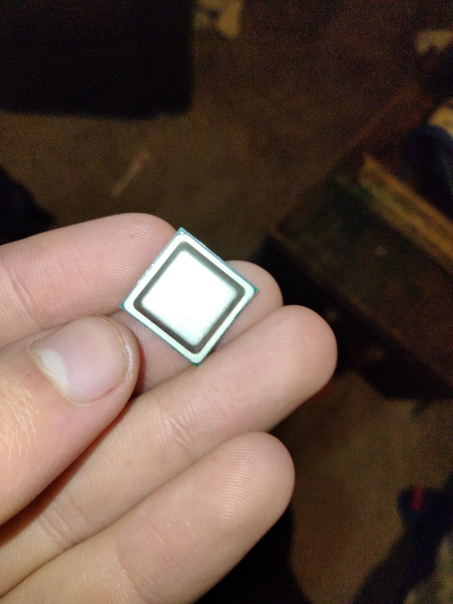

## Enrollment Chip?

Yup. As helpfully pointed out by a user in IrwinTech, chromeOS enrollment is actually controlled by a physical chip on the chromebook. This chip contains all of the neccesary data required to control the management and enrollment status of the chromebook, including the serial number of the chromebook, the school district it's enrolled into, and even the name of the person using it.

The person who pointed this out was asking for help however, as they wanted to remove it and did not know how. We however, managed to find a way.

### Removal

Looking into the source code of the firmware, it was clear that the devs had made a fatal mistake; if the chip is not present, it will skip the enrollment phase entirely and proceed to working as a normal chromebook.

We found that the enrollment chip is the largest chip on the board, usually under a thermal pad / heatsink to stop it from overheating during enrollment. On my model, it looked like this

Due to the complicated method google uses on chromebooks, the chip is actually not fully soldered on, only using a solder mask. This means you should be able to pull off the chip with force, or just slide a knife under the chip.

After the removal and powerwashing the chromebook it will fail to enroll and allow you to use it as a normal device! This circumvents pretty much all restrictions.

## Tutorial

If you need a quick tutorial on how to do this if you're confused, a ~~member of Mercury Workshop~~ pedophile has made this video

<iframe width="560" height="315" src="https://www.youtube.com/embed/Df6QF6cEyrM" title="YouTube video player" frameborder="0" allow="accelerometer; autoplay; clipboard-write; encrypted-media; gyroscope; picture-in-picture" allowfullscreen></iframe>
