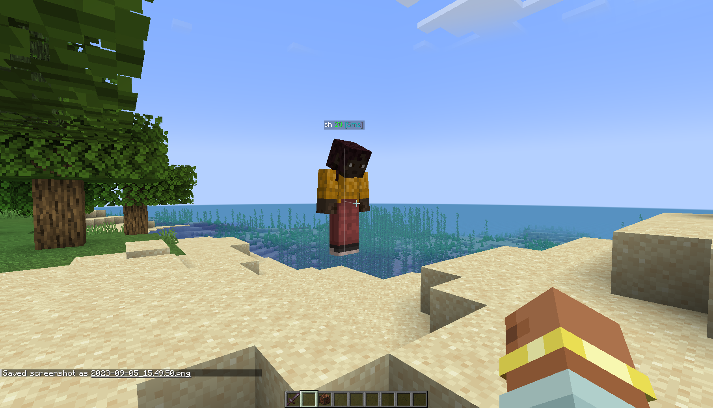

[**here**](https://github.com/CoolElectronics/minecraft.sh) is the project. i'll let you just check it out and leave here without having to listen to my inane ramblings. have fun!

<br />
<br />
<br />
<br />
<br />
<br />
<br />
<br />
<br />
<br />

# my inane ramblings

I've always had a conflicting mix of respect and frustration with using bash as a programming language, so when I found myself one day with a little _too much_ free time, I decided I wanted to do something semi-complicated with it to really get a feel for it.
And minecraft is complicated. there's state, ticks, so so many things to synchronize. but at the end of the day, everything goes down a tcp stream.

and bash can do tcp!<br/>
`echo "nya" > /dev/tcp/localhost/25565`<br/>
there, I just sent data over tcp to my local minecraft server, and you can too as long as your copy of bash was compiled with net redirections enabled

we'll want to keep the stream open of course, so map it to a file descriptor<br/>
`exec 3<> /dev/tcp/localhost/25565`<br/>
and now we can send and receive the binary data from the server

a lot of people think you can't handle binary data in bash. this isn't true.

what you can't do is _store binary data inside variables_, since bash uses C style NUL terminated strings internally.

the trick of course, is to just not store the null bytes in variables. all other types of passing data around work just fine

here's one of the most essential gadgets in the pure-bash toolkit, consuming data from stdin and sending it elsewhere

```bash
readn(){
	count=$1
	if (( count == 0 )); then return; fi

	while IFS= read -r -n1 -d $'\0' ch; do
		if [ -n "$ch" ]; then
			echosafe "$ch"
		else
			echo -en "\0"
		fi

		if (( $((--count)) == 0 )); then break; fi
	done
}
```

with some clever use of `read -d` to get around the nullbyte dilemma, we've implemented a function that does more or less the same thing as `head -c` without actually having to call it. as for actual data processing, hex is far easier to work with than binary, so let's turn the data into that

```bash
fromhex() {
	while IFS= read -r -n2 ch; do
	    echo -en "\x$ch"
	done
}
tohex(){
	while IFS= read -r -n1 -d $'\0' ch; do
		if [ -n "$ch" ]; then
		    printf "%02x" "'$ch"
		else
			echo -n "00"
		fi
	done
	echo
}
```

and now with something like `data=$(readn 5 <&3 | tohex)` we can read binary data from the server safely and easily parse it.

want to send data back to the server? just work with hex, and at the end throw it all back into "fromhex" before redirecting it to wherever

time to put it into practice and actually join a server

# a brief introduction to the minecraft protocol

note: this section, as well as the entire rest of the codebase work on the assumption that the server has "offline-mode" enabled, which allows clients to connect without having to authenticate with microsoft's servers

Minecraft uses a packet system for keeping everything in sync, where each message has a packet id and a message

to connect, we need to give the server a handshake packet, consisting of the protocol version, the host, port, and what we want the server to do (in this case login)

I wrote all this for 1.20.1, where the protocol version was 763, or `fb05`<br/>
the host is localhost, in hex `096c6f63616c686f7374` (the length of the string goes before it)<br/>
the port is 25565, so `63dd`<br/>
and lastly we want to tell the server we're logging in, and the value for that happens to be `02`. that's all 16, or `10` bytes long and the packet id is `00`

open the tcp connection again....<br/>
`exec 3<> /dev/tcp/localhost/25565`<br/>
and send our data<br/>
`echo -n "1000fb05096c6f63616c686f737463dd02" | fromhex >&3`<br/>
now we need to identify ourself. let's go with the username "sh" which encodes to `027368`. remember to add the packet length and id too<br/>
`echo -n "050002736800" | fromhex >&3`

ah! and will you look at that


and if we look around on a normal client, sure enough we'll see the player floating in the air, since gravity is purely client-sided



with just those 3 commands, we're no longer just making a shell script that handles binary data, the server will now treat us as an actual player

I think I've done a good enough job at explaining the basic idea behind everything, now i'll just be talking about how I got from here to the final repository

# the rest of the project

If you did try that example yourself, you'll see that the client will disconnect after a little while with "timed out"', which happened because we didn't respond to the server's "keep alive packet" within a certain time interval and the server kicked us.

so obviously that was the first clientbound packet I implemented. then I added chat, entity interactions, and then a basic killaura script by listening for the packet `0x01 Spawn Entity` and instantly sending an `0x10 Interact` packet to attack the entity

but then I noticed that after a little while the client was still getting kicked with "timed out" even though I was sending the keep alive packet and the server was receiving it. so why wasn't it working?

## bash is really slow, actually

you might have already guessed, but the problem was that the server was writing packets far faster than my little script could read them.<br/>
this was unsurprising. while the claims of "pure bash" sound impressive, the reality is that the pure-bash implementations of reading data and hex conversions are terribly, horrifically slow and should really never be used unless you have no other choice.

but even with those functions replaced with the dedicated utilties (head and xxd), it was still timing out eventually.

so in a moment of weakness, I did something drastic and switched over from bash to ksh93

At the expense of debugging features and the convienent "bashisms", the official at&t shell promised speed, and after porting everything over, sure enough my connection-based woes went away

but as I added more and more logic, the dreaded message started to come back and the only thing left to do was try and optimize the code

### optimizing bash

The words "optimize bash" next to each-other are not something you hear on a daily basis. If you're lucky, you'll never have to hear them ever again

the main loop looked something like this:

```bash
while true; do
	length=$(getpacketlength) # irrelevant

	process_packet < <(head -c "$length")
done <&3 # &3 is the file descriptor to the tcp stream
```

each packet starts with its byte length, so we tell `head` to read exactly that many bytes and pass it to a function called `process_packet`

Since this is TCP and bash, the data has to be consumed sequentially, no skipping around. The processing itself can be staggered though

at first I thought to use a named pipe, but since you can only write data as fast as the processing process reads it it wouldn't make a difference

eventually I ended up with this

```bash
while true; do
	length=$(getpacketlength) # irrelevant

	head -c "$length">tempfile
	{
		process_packet <tempfile
	} &
done <&3 # &3 is the file descriptor to the tcp stream
```

you would think that since it has to spin on I/O to a temporary file that this would be slower, but it ended up speeding the program up considerably, since it can now consume several packets immediately, fork() a few times, and worry about processing later

This opened up another problem, that there are now a bunch of bash forks, all handling packets in a non-deterministic order, and state needs to be shared between all of them

since these are discreet processes and not threads, that can get difficult. there are a few solutions for this, including this [hilariously cursed stackoverflow answer](https://stackoverflow.com/a/15546577).
I opted for storing temporary files in /dev/shm, since it was versatile and easy

Parallelism means race conditions, which lead me to discovering a really nice solution for blocking locks using mkfifo, which works because reading from the pipe will hang until there's a writer

and now that most of the major problems were gone, I could start working on the position based packets, which sounded fun at first, until I realized what the type signature was


## my own personal data type hell

I googled a few times and couldn't find any working code for decoding floats from hex and started to panic. I went over to the wikipedia page for floating-point numbers and didn't understand shit

eventually, [this visualization](https://www.h-schmidt.net/FloatConverter/IEEE754.html) came to save me, and I started to get an implementation going

I'm not the type of creature to develop a lot of C, so I had been wary of bitwise operators for a while, but looking at the chart it started to make sense;
i flipped all the bytes on the mantissa to one and everything else to zero, and that made a bit mask, then I could do the same for all the other fields, and just multiply it all together

```bash
fromfloat(){
	mantissa=$(( 0x$1 & 0x007fffff ))
 	exponent=$(( ( ( 0x$1 & 0x7f800000 ) >> 23 ) - 127 ))
 	sign=$(( ( ( 0x$1 & 0x80000000 ) >> 31 ) * -1 ))

 	if [ "$sign" = "0" ]; then
		sign=1
 	fi

	bc -l <<< "( 2 ^($exponent) * ( 1 + $mantissa / ( 2 ^(22) * 2 ) ) * $sign )"
}
```

obviously i'm not treading any new ground here, but this was really cool to me personally and something I definitely wouldn't have learned if not for this project

but *en*coding was a different story. I couldn't find a trivial explanation anywhere about how you were supposed to end up with the value of the mantissa and exponent

and this, dear reader, is when I made a terrible mistake. I went to chat dot openai dot com and humbly asked chatgpt to explain how ieee754 floats were encoded. it spat out something about moving around zeros and binary, and I blindly trusted it and started thinking about the implementation. an indeterminate amount of time later, I ended up with this

```bash
tofloat(){
	dec=$1
	# get sign bit
	if [ "${dec:0:1}" = "-" ]; then
		dec=${dec:1}
		sign=0x80000000
	else
		sign=0x00000000
	fi
	# get binary rep of number
	bin=$(echo "obase=2;$dec" | bc)
	# add back the .
	case $bin in
		*"."*) ;;
		*) bin="$bin." ;;
	esac

	# use the number of decimal places to calculate the exponent after normalization
	# for example 1100.1000 has 4 bits before the decimal meaning an exponent of 3
	places=${bin%\.*}
	exponent=$(( ${#places} + 127 ))
	# shift exponent behind mantissa
	exponent=$(( exponent << 23 ))
	# extend to 23 bytes
	binlen=${#bin}
	zeros=00000000000000000000000
	toadd=$(( 24 - binlen ))
	if (( toadd < 0 )); then
		toadd=0
	fi
	bin="$bin${zeros:0:$toadd}"
	# the decimal point was just for internal reference, remove it and convert to decimal
	mantissa=$(( 2#${bin/\./} ))

	printf "%04x" "$(( sign | exponent | mantissa ))"
}
```

i tested it on a few numbers, and it seemed to work so I called it a night and went onto something else

then i had to send a packet that required a precise fractional component, and i realized i had been sold total bullshit, because everything broke entirely

so i guess i got what I deserved for trusting chatgpt's steps

## cool stuff

Now that I had floats more-or-less working I could implement most of the remaining clientbound and serverbound packets, and everything went pretty smoothly

i wanted everyone to be able to experience the cursedness and not just me, so I added a system of "hook" functions which would make extensibility and bots easy to create, even making a [docstring -> markdown](https://github.com/CoolElectronics/minecraft.sh/blob/master/docsgen.sh) generator

here's some code that would create a bot that automatically strip-mines in a straight line using the library

```bash
source src/minecraft.sh
DELAY=0.25
start_login

sleep 4
while true; do
  wait_on_login
  m_get_player_pos
  for i in {0..2}; do
    for j in {0..1}; do
      m_mine_relative "$i" "$j" 0 "$DELAY"
      m_mine_relative "$i" "$j" 0 "$DELAY"
    done
  done
  for i in {0..4}; do
    m_move_relative 1 0 0
    sleep 0.1
  done
  for i in {1..3}; do
    m_mine_relative -1 1 "$i" "$DELAY"
    m_mine_relative -1 1 "$i" "$DELAY"
  done
  for i in {1..3}; do
    m_mine_relative -1 1 "-$i" "$DELAY"
    m_mine_relative -1 1 "-$i" "$DELAY"
  done
  sleep 0.1
done
```

Is this practical? should you be writing minecraft bots in bash? probably not, but now you can

check out the [github repo](https://github.com/CoolElectronics/minecraft.sh) for all the examples and documentation and [follow me](https://akkoma.mercurywork.shop/coolelectronics) on the fediverse for more cursed projects

# closing thoughts

despite all the headaches, if you've made it this far I do truly recommend you to make a complicated-ish project like this in bash yourself. you don't truly know the language until you make a project this large, and I still feel like I don't even know the language after all of this. even if I didn't get anything much out of it that i could use in practice, it was still a really enjoyable experience

### credits

- while I was doing research for this I found [this repo](https://git.sakamoto.pl/domi/Witchcraft/-/tree/meow/src), where someone did this the other way around, creating a server in bash that official clients could connect to. The VarInt implementation was ripped directly from there because I didn't feel like writing it myself
- i would also like to personally thank each and every one of the amazing people who edit [wiki.vg](https://wiki.vg), none of this would have even been an idea if not for the great documentation and reversing efforts there
