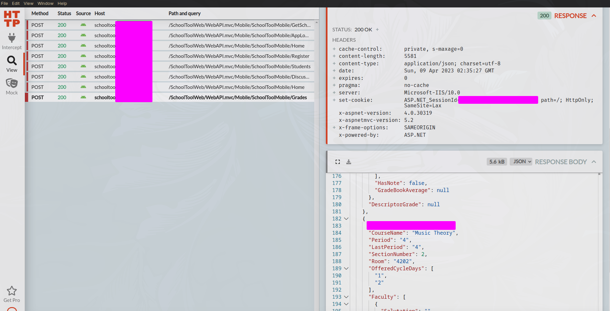
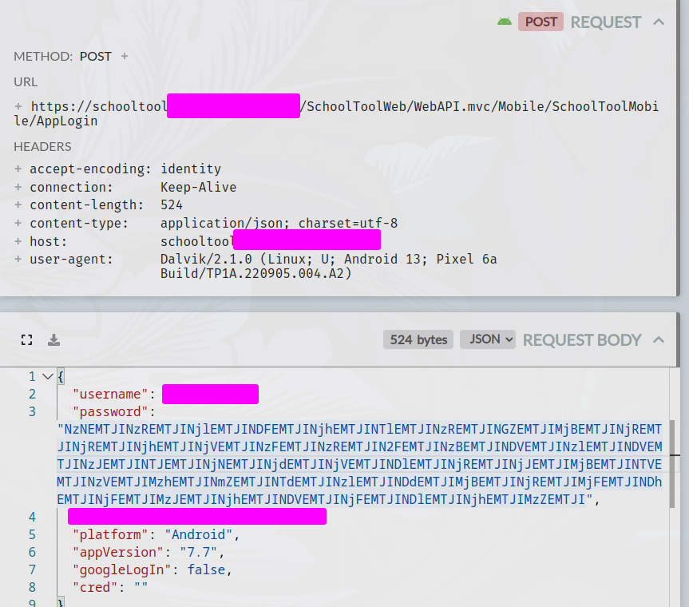

### Introduction

Through a series of misfortunes, my entire school district ended up needing to use the SchoolTool grading software for everything attendance and grades related.
Simply put, the default web interface for schooltool is a steaming pile of garbage. I will spare you the rant on this, but just know that it's a heap of bad decisions and legacy without a single redeeming quality.

The mobile UI isn't designed _that_ awfully, but I don't really like mobile. What I do like are terminal UI's, rust, and terminal uis written in rust. Let's get started.

## SchoolTerm

Obviously, schooltool has no publicly documented API. That would be far too easy, so instead we have to pretend to be an official client to get our data.
The first thing I do when designing scrapers like this is open the offical website with devtools and start recording network traffic. Here's where we start to see the horrible design decisions come into play.

Searching for some of the class names in the network requests shows that a good amount of the data is rendered server side. Server side rendering isn't a bad design decision (the content you're reading right now is server side rendered), nor is it a death knell for scrapers (regex and html parsers exist) but it adds a bit more work for us.
The second thing that becomes apparent is that this was written in ASP.net with angular 1.0 as the frontend. I won't go too heavy into critiquing other people's coding styles but both frameworks are heavily opinionated (not in a good way), legacy and objectively Not Good.

A good developer team could make a decent web app in ASP, but unfortunately the world got schooltool. For some reason, they made it that the buttons for the different views (for example clicking on "Assignments" or "Grades") would be links, with the targets set to javascript: urls, a very confusing and innacurate design practice. Not only that, but what's funny is that a lot of school administrators restrict javascript: urls, as they can be used for filter circumvention methods such as ltbeef or blank3r.
What's worse is that instead of just having separate links to paths for the different views (eg, /Grades, /Assignments) like yknow every other SSR'd website on the planet, they reload the page and set a specific header for the view you want to see?
And due to even more bad decisions, this has a 50% chance of just straight up losing your session key and signing you out.

Overall, this leaves us with a very odd and confusing api if we wanted to use it for our own purposes. Instead I decided to check out the API for the mobile app, which could likely have an easier to use API.
Fortunately, the people who made the mobile app actually knew what they were doing for the most part and the app is actually usable!
Reverse engineering on android can be a little more difficult, but with an emulator or better, a rooted phone we can use one of my new favorite tools, [Http Toolkit](https://httptoolkit.com/). It's a beautifully designed interface for intercepting and messing with all sorts of http requests. Hooking it up over ADB and opening the schooltool app, we can start to make some sense of the data



Ah. Now this is usable!

### The Mobile API

We can start mocking out the client now, using the authentication tokens from http toolkit.

```
let client = reqwest::Client::new();
let resp = client.post(format!("{}/SchoolToolWeb/WebAPI.mvc/Mobile/SchoolToolMobile/Grades",APP_ROOT))
    .header("authorization","<the token we got earlier>")
    .body(json!{
        // body extracted from http toolkit
    })
    .send()
    .await?
    .json::<HashMap<String, String>>()
    .await?;
println!("{:#?}", resp);
```

I'll be using `reqwest` obviously (:3), and with a bit of fiddling around this will return final grades for the specified quarter. Great!

This works as a proof of concept, but for the real app it would obviously be inconvienent to have to manually extract an authorization string.
Typically there's a separate login endpoint where you can trade in your username and password for a limited use session token, and schooltool is no different.
Searching around in http toolkit for the authorization token reveals this endpoint:



Everything seems normal, up until the "password" field. The value doesn't resemble anything I put into the login form. Just from looking at it you should be able to tell that it's base64, but decoding it yields this:

```
73D12H74D12H69D12H41D12H68D12H59D12H74D12H4fD12H20D12H64D12H64D12H68D12H65D12H71D12H74D
12H7aD12H70D12H45D12H79D12H45D12H72D12H52D12H63D12H67D12H65D12H49D12H64D12H62D12H20D12H
55D12H75D12H38D12H6fD12H57D12H79D12H47D12H20D12H64D12H21D12H48D12H61D12H32D12H68D12H45D
12H61D12H49D12H68D12H36D12H
```

This isn't any encoding/hashing scheme that I was familiar with, and there was no obvious way of decoding it or generating it.
Remember that in order to make this a usable tool, it would need to be able to take the user-inputted password in plaintext and somehow generate this cryptic format.
I tried a few more things and even resorted to consulting chatgpt, all to no avail.
With no options left, it was time to decompile the app.

### Decompilation

With some `pm` and `adb` commands it's trivial to pull down the schooltool APK and get started on the decompilation.
Because google is google, apk files are really just glorified jar files, and because Sun Microsystems is Sun Microsystems, jar files are really just glorified zip files.
Immediately after unzipping I notice the "assemblies" folder. This popped out to me because Java (the default language for android apps) isn't "assembled", it's a bytecode language and it doesn't have "assemblies".
Looking at the contents of the folder confirms my suspicions; it's filled with .dll files. But aren't dlls for windows programs? What are they doing in an android app? Well, the presence of files for the `Xamarin` framework in the folder confirms that the app was indeed not written with java, but C#.
Using C# with the dotnet framework will compile to dll files, which are not normal dll files but a special bytecode format that can be loaded cross-platform. Here's where we get lucky: because of the framework used, all of the important code is contained inside a single SchoolTool.dll file in the assemblies folder, and dotnet assembled code is notoriously easy to decompile.
There's very little optimization done during the compilation step so the code that the developers have is going to be nearly identical to the decompiled version, minus comments and some syntax sugar.
The decompiler couldn't read it at first due to some weird compression stuff, but some googling led me to this [decompresssor](https://github.com/x41sec/tools/blob/master/Mobile/Xamarin/Xamarin_XALZ_decompress.py). Now I could open up my trusty copy of IlSpy and peek inside.
After a few minutes of wading through cryptic symbols, I found exactly what I was looking for: a function named "EncryptPassword" that appeared to generate the exact mystery format.

```
public static string EncryptPassword(string password)
{
	string text = "tAYOdhqzEERgIbU8WGdH2EI6YS77pILeLVsOjVd5gzVvX43Blm";
	string text2 = "D12H";
	string text3 = "";
	string text4 = "";
	for (int i = 0; i < password.Length; i++)
	{
		text3 = ((!string.IsNullOrEmpty(text3)) ? (text3 + password[password.Length - (i + 1)] + text[i]) : (password[password.Length - (i + 1)].ToString() + text[i]));
	}
	for (int j = 0; j < text3.Length; j++)
	{
		text4 = text4 + Convert.ToString(text3[j], 16) + text2;
	}
	return Convert.ToBase64String(Encoding.GetEncoding(28591).GetBytes(text4));
}
```

Ah, what a _lovely_ bit of code. Let's unpack this.<br/>
First of all, you should be able to tell that despite the name, this is absolutely not encryption! It's not even a hashing algorithm, all it does is insert some random "salted" garbage data and call it a day.
I can't possibly imagine this having any security advantages since you can reverse the process in 2 lines of rust and get the original password.

```
fn decode_password(encoded: String) -> String {
    let bytes = &base64::decode(encoded).unwrap();
    let s = std::str::from_utf8(bytes).unwrap();
    (0..s.len())
        .step_by(12)
        .map(|i| u8::from_str_radix(&s[i..i + 2], 16).unwrap() as char)
        .rev()
        .collect()
}
```

Therfore, I have to assume that this function only exists to waste a few hours of my time specifically. Either way, here's a reimplementation of their "EncryptPassword" function in rust.

```
fn encode_password(password: String) -> String {
    let passlen = password.chars().count();

    let salt = "tAYOdhqzEERgIbU8WGdH2EI6YS77pILeLVsOjVd5gzVvX43Blm";
    let salt2 = "D12H";
    let mut buffer3 = String::new();

    for i in 0..passlen {
        buffer3 += &(password.chars().nth(passlen - (i + 1)).unwrap().to_string()
            + &salt.chars().nth(i).unwrap().to_string());
    }
    let mut buffer4 = String::new();
    for ch in buffer3.chars() {
        buffer4 += &format!("{:x}{}", ch as u8, salt2);
    }
    base64::encode(buffer4)
}
```

Now we can plug this into the /AppLogin endpoint from earlier and grab our authentication token

```
let req = client
    .request(Method::POST, format!("{}{}/AppLogin", base_url, ENDPOINT))
    .header("Content-Type", "application/json;charset=utf-8")
    .body(
        json!({
            "username": username,
            "password": encode_password(password)
        })
        .to_string(),
    );
```

And with that, we can grab any data we want. Time to build a nice TUI wrapper around it.
I used the console_engine library, but it really wasn't suited for my needs. Maybe I'll make my own at some point but for now, you can check out the program and all code [here](https://github.com/CoolElectronics/schoolterm)
